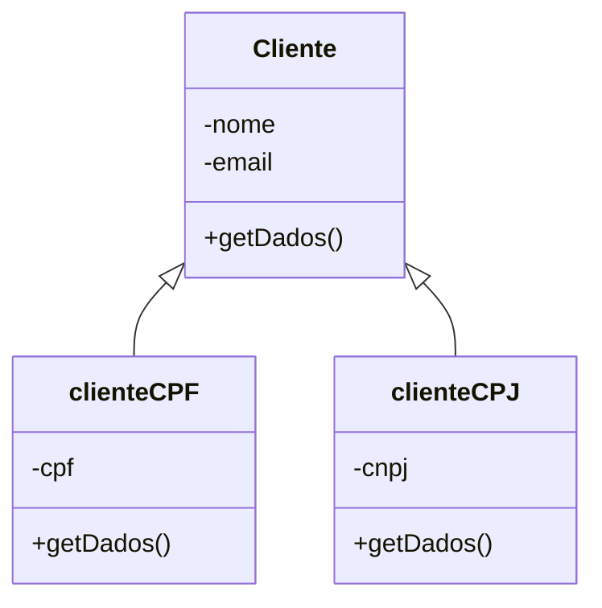

```mermaid
classDiagram
Cliente <|--clienteCPF
Cliente <|--clienteCPJ
class Cliente{
    -nome
    -email
    +getDados()
}
class clienteCPF{
    -cpf
    +getDados()
}
class clienteCPJ{
    -cnpj
    +getDados()
}

```